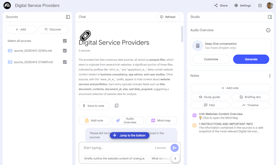

# Review web sources and snapshot as Markdown 

Crawler to scan websites as listed in sources.txt and snapshot as Markdown files, suitable for use in Notebook LM

When uploaded into an AI tool such as [Notebook LM from Google](https://notebooklm.google/), it allows you to run queries on this dataset, "talk" to the data, generate mindmaps and podcasts etc. 

Why is this needed? If the URLs are added directly to Notebook LM, Google does not index the website contents.



## Installation of required libs

Assuming you have Python installed.
   ```bash
   virtualenv venv
   pip install -r requirements.txt
   ```
When returning to this project
   ```bash
   source venv/bin/activate
   ```

## Configuration and Folder Structure

Settings at top of `download.py` allow configuration of download depth, number of downloads, and Markdown file structure etc. 

The following folders will be created / cleared as needed:

- `downloads_html`: Directory for storing downloaded HTML files.
- `downloads_parquet`: Directory for storing Parquet files converted from HTML.
- `downloads_md`: Directory for storing the final Markdown files. *will not be deleted*


## Usage

1. Prepare a text file containing the list of URLs to process (e.g. `sources.txt`), with one URL per line. Each URL should start with http or https.
   ``` text
   http://www.mysampleurl.com
   https://www.anotherurl.ie
   ```

2. Run the script:
   ```bash
   python3 download.py 
   ```
   The script will look for a previous run , checking for `url_snapshot.json` (a record of previous progress)
   If not present, the script defaults to reading `sources.txt` - it will generate `url_snapshot.json` for future attempts.

   Deleting the `url_snapshot.json` file will reset the list and `sources.txt` will be read again

3. The script will:
   - Download the content of the URLs/ websites (including following internal links to a depth specified in the config).
   - Convert the content to Parquet format.
   - Generate the Markdown files with this content in the `downloads_md` directory.

4. Note about uploading to NotebookLM
   The md files generated can be directly imported into Notebook LM.
   It is good practice to include the url_snapshot.json (rename to .txt) so you know what information Google Gemini is using.
   MD files can be manipulated before upload as required (e.g. edited, combined).

## Robust restart functionality and troubleshooting

The script only reads information, so nothing can "break". Any information in the download folders can be safely deleted (as the info will be recreated during a future script run).

1. The Crawler takes websites in blocks of X at a time (can be configured at top of `download.py`).
1. It saves a snapshot of completed websites / websites remaining in `url_snapshot.json`.
1. This means if the crawl is interrupted it can be run again without missing anything but also without duplication. 
1. Deleting `url_snapshot.json` resets this, the next run will start again using the urls in `sources.txt`

Since the crawler respects robots.txt, it may pause for several seconds between downloads.

In general it is safe to terminate the script, manipulate the `url_snapshot.json` file and try again.

The flag `SINGLE_RUN_NO_LOOP` in `download.py` in the script sets the script to run once (one block of urls), or multiple times until all urls have been captured. This allows for a workaround (possible memory leak in the DPK / Scrapy crawler used). A simple convenience script `download.sh` supports this i.e. Python is allowed to exit, memory freed up, then script called again for the next run.


